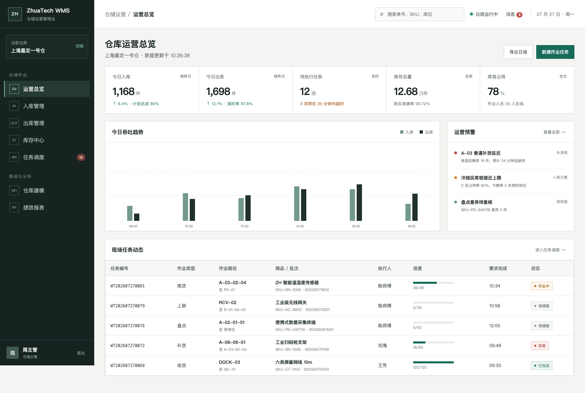
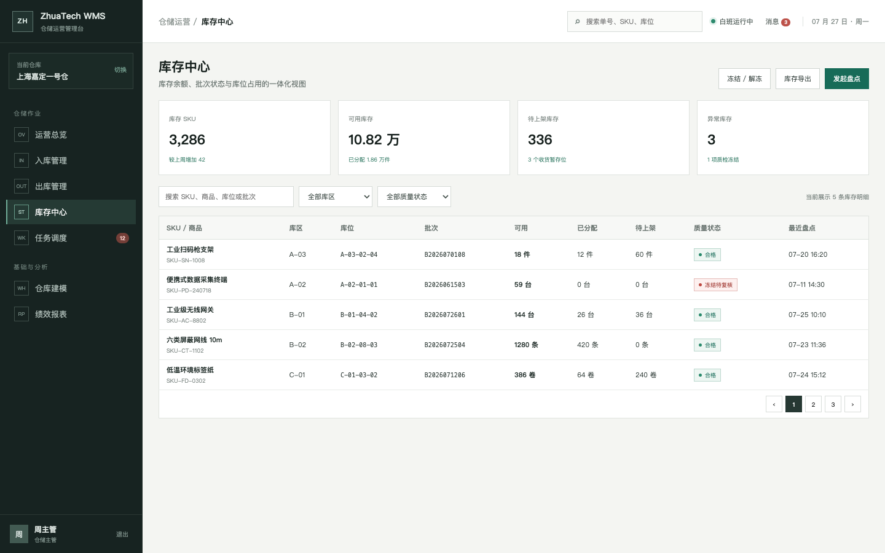
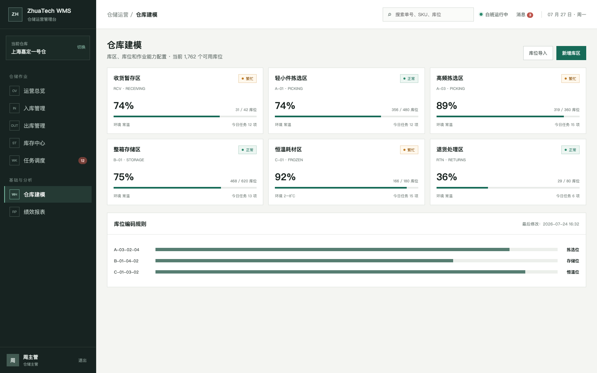
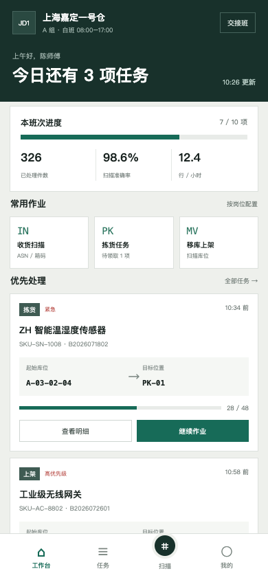
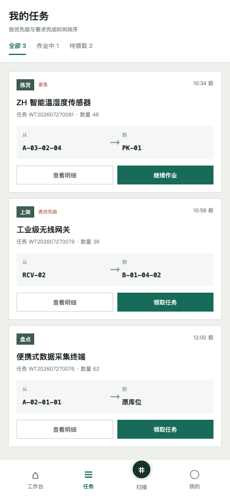
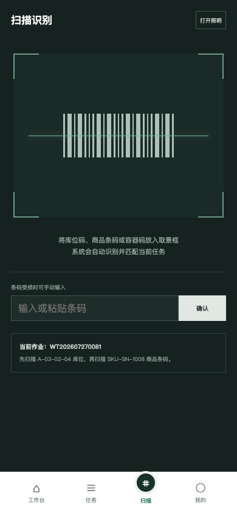

# ZhuaTech WMS｜知华科技仓储管理系统社区源码版

> 一套面向仓库现场与管理人员的前后端分离 WMS。把预约收货、上架、库存、波次、拣选、补货、盘点、复核和发运连接成可执行、可追踪的仓储作业链。

[知华科技](https://www.zhuatech.cn/)（上海如静知华信息科技有限公司）提供企业信息化、WMS/ERP/OMS 系统建设、私有化部署与深度定制开发服务。

    

> [!IMPORTANT]
> 本工程仅允许个人、非商业性的学习、研究与技术交流。企业内部使用、生产部署、SaaS、实施交付、外包、咨询、集成或其他任何直接及间接商业使用，均须事先取得上海如静知华信息科技有限公司的书面授权。本项目为 source-available 社区源码项目，不是 OSI 认可的开源软件。完整条款见 [LICENSE](LICENSE)。

## 两个工作面，一套库存事实

仓库主管在管理端看吞吐、库存和人员负荷，现场人员在手机或手持终端领取任务、扫描库位并回报数量。二者通过同一套 REST API 与 MySQL 数据模型协作。

| 仓库作业端（H5） | 后台管理端（PC） |
| --- | --- |
| 班次工作台、任务领取、扫码、作业进度、个人统计 | 运营总览、入库、出库波次、库存、任务调度、仓库建模、绩效报表 |
| 面向收货员、上架员、拣货员、盘点员 | 面向仓库主管、调度员、库存管理员、经营分析人员 |

### 动态库位推荐

`POST /api/wms/insights/slotting` 根据 SKU 日均拣选行数、体积、重量、当前行走距离以及危险品/易碎属性，推荐快速拣选区、标准区、大件区或受控区，同时给出迁移优先级和预计行走距离降幅。危险品与承重规则优先于动销等级，避免只按销量排库位带来的安全问题。

### 后台管理端



管理端使用克制的工业型界面：信息密度优先，重点数据、异常和截止时间在同一视线内完成判断。

| 入库与库存 | 仓库建模 |
| --- | --- |
|  |  |
| 按 SKU、批次、质量状态、库区和库位查询库存 | 查看库区环境、库容占用、库位数量和运行状态 |

### 仓库作业端

| 班次工作台 | 我的任务 | 扫码作业 |
| --- | --- | --- |
|  |  |  |
| 班次目标、优先任务和常用动作 | 任务路线、数量、时限与领取状态 | 识别库位码、商品码和容器码 |

## 仓库的一天如何流转

```text
供应商预约 → 到仓排队 → 月台收货 → 质量检验 → 推荐上架
                                             ↓
订单下发  ← 发运交接 ← 集货复核 ← 波次拣选 ← 库存分配
                       ↑              ↑
                   异常处理       缺货触发补货
                                      ↓
                            循环盘点 → 差异复核
```

第一版已经实现以下业务骨架：

- 入库：预约单、供应商、月台、收货数量、质检状态和操作员。
- 出库：波次释放、订单/SKU 聚合、拣选进度、承运商与截单时间。
- 波次放行校验：综合拣选完成率、异常任务、截单倒计时与月台就绪状态，给出可放行、风险或阻断结论及处理动作。
- 库存：SKU、商品、仓库、库区、库位、批次、质量状态、可用/分配/待上架数量。
- 作业：收货、上架、拣货、补货、盘点、复核打包六类任务，含优先级、执行人、路线、进度和异常。
- 仓库：收货区、拣选区、存储区、恒温区、退货区的库容和环境建模。
- 分析：实时吞吐、账实准确率、准时率、人员效率、库区占用与运营预警。
- 权限：管理员、主管、作业员、只读分析员四类角色，JWT 鉴权。

## 技术轮廓

```text
Vue 3 + Vite + Pinia
  ├─ /work/*   仓库作业端（H5 / PDA）
  └─ /admin/*  后台管理端（PC）
            │ REST / JSON
            ▼
Spring Boot 4 + Spring Security + JPA + Flyway
            │
            ▼
MySQL 8.4（wms_ 表前缀）
```

后端 Java 根包为 `cn.zhuatech.wms`。主要实体为 `WarehouseTask`、`InventoryBalance`、`InboundReceipt`、`OutboundWave`、`WarehouseZone` 和 `UserAccount`。架构取舍见 [docs/ARCHITECTURE.md](docs/ARCHITECTURE.md)，接口见 [docs/API.md](docs/API.md)。

## 5 分钟运行

### Docker Compose

要求 Docker 与 Docker Compose 可用：

```bash
cp .env.example .env
docker compose up --build -d
```

浏览器打开 `http://localhost:8088`。停止服务使用：

```bash
docker compose down
```

### 只看前端演示

前端内置与真实业务结构一致的演示数据，不依赖后端：

```bash
cd frontend
npm install
npm run dev:demo
```

登录页可切换“仓库作业端”和“后台管理端”。演示模式可直接进入，默认账号如下：

| 角色 | 用户名 | 密码 | 默认入口 |
| --- | --- | --- | --- |
| 系统管理员 | `admin` | `ZhuaTech@2026` | `/admin/dashboard` |
| 仓库主管 | `supervisor` | `Demo@2026` | `/admin/dashboard` |
| 现场作业员 | `operator` | `Demo@2026` | `/work/home` |
| 只读分析员 | `viewer` | `Demo@2026` | `/admin/reports` |

这些账号和数据仅用于本地学习。任何经授权的联网部署都必须修改数据库密码、账号密码和 `JWT_SECRET`。

### 本地开发

```bash
# 后端，需要 JDK 21、Maven 3.9 与 MySQL 8
cd backend
mvn spring-boot:run

# 前端，另开终端
cd frontend
npm install
npm run dev
```

配置项均可通过环境变量覆盖，示例见 [.env.example](.env.example)。数据库结构由 `backend/src/main/resources/db/migration` 下的 Flyway 脚本维护。

## 工程目录

```text
zhuatech-wms/
├── backend/                 Java 21 / Spring Boot API
│   └── src/main/java/cn/zhuatech/wms
├── frontend/                Vue 3 双端前端
│   └── src/views/
│       ├── admin/           PC 管理端
│       └── mobile/          H5/PDA 作业端
├── docs/                    架构、API 与实机截图
├── deploy/                  部署注意事项
├── compose.yaml             MySQL + API + Nginx 一键编排
└── LICENSE                  非商业社区源码许可
```

## 当前边界

这是可运行的第一版业务样板，不应在未获授权、未完成安全加固的情况下直接承载生产仓库。自动分配算法、电子标签/DPS、AGV/输送线、打印服务、称重设备、多仓多货主、计费结算、消息队列、审计中心和高可用方案属于后续扩展范围。

欢迎个人学习者通过 Issue 提交可复现的问题，贡献前请阅读 [CONTRIBUTING.md](CONTRIBUTING.md)、[CODE_OF_CONDUCT.md](CODE_OF_CONDUCT.md) 与 [SECURITY.md](SECURITY.md)。

## 商业授权与深度定制

知华科技可提供仓储业务蓝图、WMS/ERP/OMS 对接、扫码/PDA 应用、仓库自动化设备集成、数据迁移、私有化部署、性能治理及长期技术支持。

- 官网：[https://www.zhuatech.cn/](https://www.zhuatech.cn/)
- 公司：上海如静知华信息科技有限公司
- 咨询：访问官网，或扫描以下任一微信二维码

<table>
  <tr>
    <td align="center"><br/>微信咨询一</td>
    <td align="center"><br/>微信咨询二</td>
  </tr>
</table>

---

Copyright © 2026 上海如静知华信息科技有限公司（Shanghai Rujing Zhihua Information Technology Co., Ltd.）

**搜索关键词：** 知华科技 WMS、ZhuaTech WMS、Java WMS、Spring Boot 仓储管理系统、Vue WMS、H5 仓库作业、PDA 拣货系统、MySQL WMS、库存管理源码、入库管理系统、出库波次、仓库扫码系统、WMS 私有化部署、WMS 二次开发、上海 WMS 定制开发、仓库数字化。

## 拣选面动态补货

新增 `POST /api/wms/replenishment-plan`。输入拣选面现存量、安全库存、预计需求、储备库存和补货提前期，即可得到需求量、建议补货量、缺口标记、紧急程度和目标完成分钟数。紧急任务会明确要求锁定作业人员，库存不足则自动给出通知库存控制员的动作。

这项能力同时服务后台计划员与仓库作业端，集成测试覆盖了 90 分钟提前期下的加急补货场景。

## 循环盘点计划

`POST /api/wms/insights/cycle-count` 按 ABC 分类、账实差异、出入库频次、距上次盘点天数和库存价值生成盘点风险分，并给出立即、七日或月度盘点时限，帮助库存管理员把有限盘点能力放在高风险 SKU 上。

## AI 仓库用工与波次预测

新增 `POST /api/wms/ai/labor-forecast`，结合订单、订单行、急单占比、平均拣选时间、自动化率、班次时长和可用人员，预测所需工时、人数缺口及跨区支援动作。默认本地计算即可使用；配置 DeepSeek/OpenAI 兼容模型后，可生成更完整的波次、人力与拣选路径优化建议。

检索关键词：AI WMS、智能仓储系统、仓库用工预测、智能波次、AI 拣选优化、DeepSeek WMS、仓储管理系统源码、知华科技 WMS。
